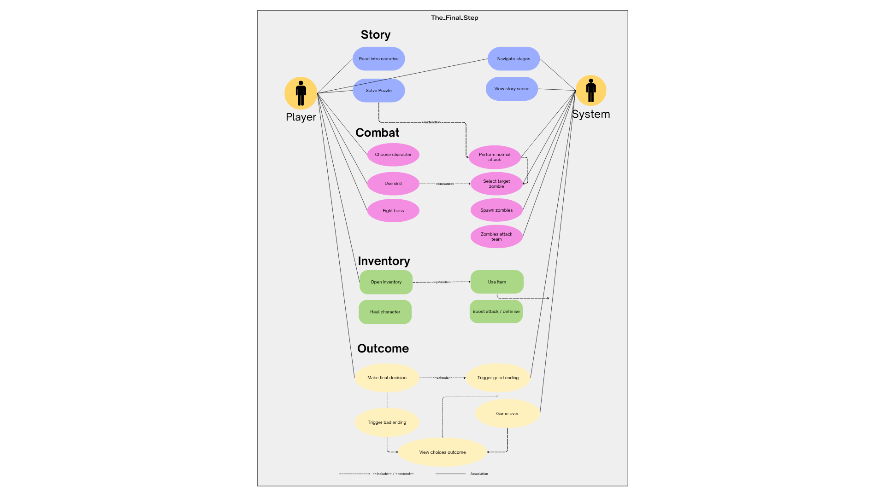
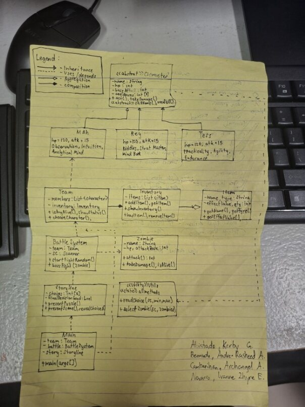

The NextStep

A turn-based trivia game where you fight off zombies by answering questions. Simple concept, but it gets intense fast.

ABOUT

The NextStep puts you in the middle of a zombie apocalypse — except instead of guns, you've got your brain. 
Every action you take in the game is tied to a trivia question. Answer right, you act. Answer wrong, and the zombies get closer.
We built this to keep things straightforward. The mechanics are easy to follow, the rules make sense, and you can jump in without reading a manual. 
The goal was never to make something overly complex — just something fun that clearly shows how a turn-based system works.

The Team Name

(Role)
Kerby Abistado - Battlesystem, Tess, Main

Andre Bermudo - mah, rey, character

Ivanne Zhyre Navarro - Zombie,Util, inventory

Archangel Cambarihan - team, storyline, item

USE CASE DIAGRAM

CLASS CASE DIAGRAM

